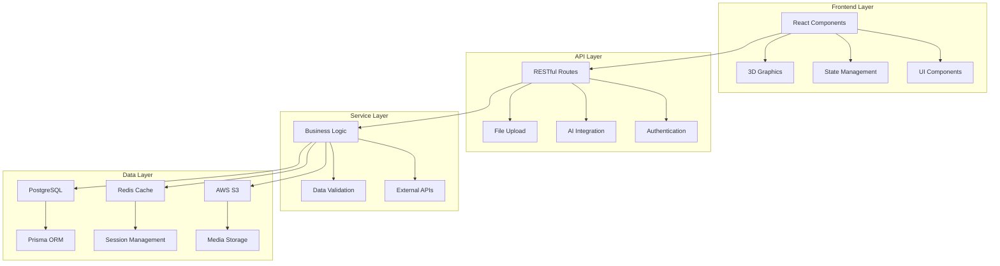
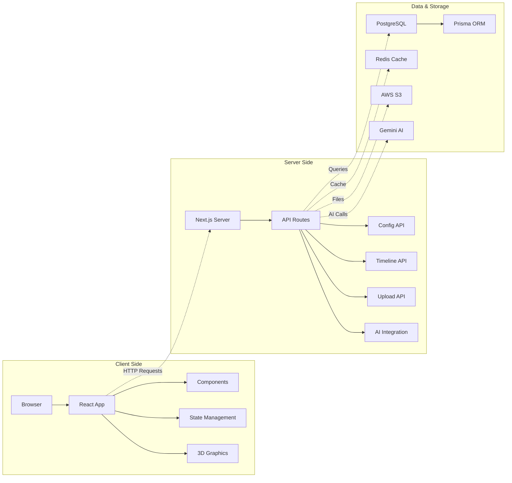
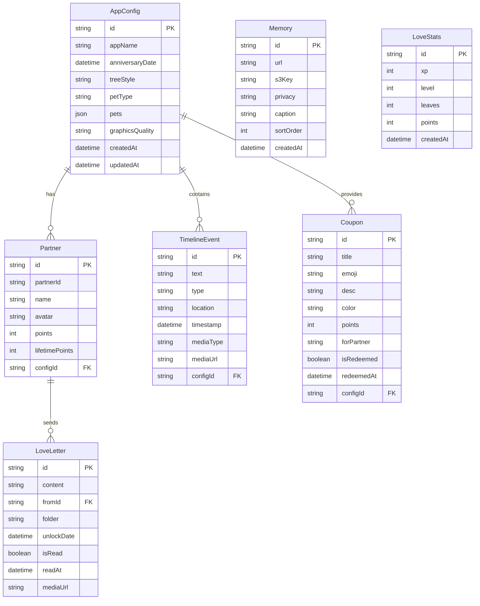
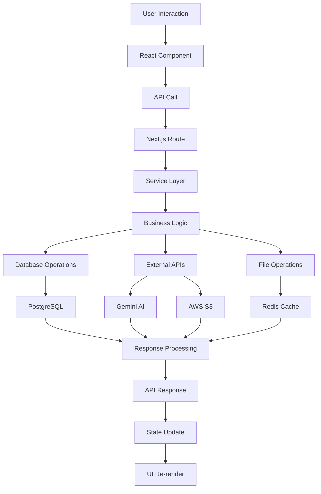
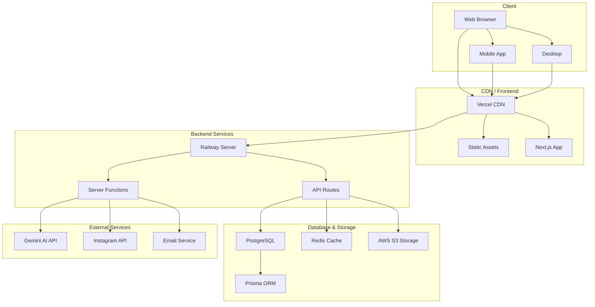
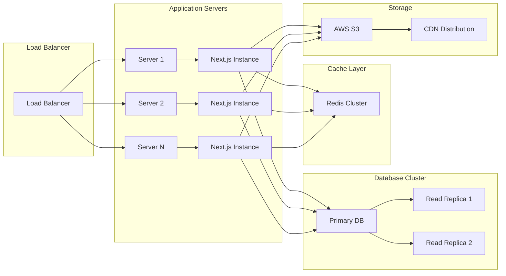

# Narinyland Architecture Overview 🏗️

## System Architecture

Narinyland is a modern full-stack web application built with Next.js 16, featuring a sophisticated relationship management system with AI-powered virtual pets. The architecture follows a layered approach with clear separation of concerns.

### High-Level Architecture Diagram



### System Layers Diagram



## Core Components

### 🎯 Frontend Architecture

#### Component Hierarchy
```
app/
├── layout.tsx              # Root layout with PWA configuration
├── page.tsx                # Main application container
└── api/                    # API routes (server-side)

components/
├── Timeline/               # Timeline display and interactions
├── LoveTree/               # 3D interactive love tree
├── MemoryFrame/            # Photo/video gallery
├── LoveCoupons/            # Reward system
├── LoveLetter/             # Scheduled messaging
├── ProposalScreen/         # Interactive proposal
├── EditDrawer/             # Configuration panel
└── OptimizedImage/         # Image optimization
```

#### State Management
- **Local State**: React hooks for component-level state
- **Global State**: Server state via API calls
- **Real-time Updates**: Polling and event-driven updates
- **Persistence**: Database-backed configuration

#### UI Framework
- **Styling**: Tailwind CSS with custom themes
- **Animations**: Framer Motion for smooth transitions
- **3D Graphics**: React Three Fiber + Three.js
- **Responsive**: Mobile-first design approach

### 🔌 API Architecture

#### Route Structure
```
/api/
├── config/                 # App configuration CRUD
├── timeline/              # Timeline events management
├── memories/              # Photo/video uploads and retrieval
├── letters/               # Love letters CRUD
├── coupons/               # Reward system
├── stats/                 # Gamification data
├── upload/                # File upload handling
├── serve-image/           # Optimized image serving
├── instagram/             # Social media integration
└── cleanup/               # Maintenance operations
```

#### API Design Principles
- **RESTful**: Standard HTTP methods and status codes
- **TypeScript**: Full type safety across API boundaries
- **Error Handling**: Consistent error responses
- **Validation**: Input validation and sanitization
- **File Handling**: Streaming uploads with S3 integration

### 🗄️ Data Architecture

#### Database Schema Diagram



#### Data Flow Diagram



#### Storage Strategy
- **Database**: PostgreSQL for structured data
- **File Storage**: AWS S3 for media files
- **Cache**: Redis for session and temporary data
- **CDN**: CloudFront for static assets

### 🤖 AI Integration

#### Virtual Pet System
```
User Input → Emotion Detection → Gemini API → Response Generation → Pet Animation
```

#### AI Components
- **Emotion Detection**: Camera-based facial recognition
- **Response Generation**: Google Gemini API
- **Animation System**: 3D model manipulation
- **Behavior Logic**: State machine for pet emotions

## Technology Stack

### Frontend
- **Framework**: Next.js 16 (App Router)
- **Language**: TypeScript
- **UI Library**: React 19
- **Styling**: Tailwind CSS
- **3D Graphics**: React Three Fiber, Three.js
- **Animations**: Framer Motion
- **PWA**: Next.js PWA features

### Backend
- **Runtime**: Node.js
- **Framework**: Next.js API Routes
- **Database**: PostgreSQL
- **ORM**: Prisma
- **Cache**: Redis
- **File Storage**: AWS S3
- **AI**: Google Gemini API

### Development
- **Package Manager**: npm
- **Code Quality**: ESLint, TypeScript
- **Deployment**: Railway, Vercel ready
- **Containerization**: Docker

## Data Flow

### Typical Request Flow
```
1. User Interaction (React Component)
2. API Call (Next.js Route)
3. Business Logic (Service Layer)
4. Database Operation (Prisma)
5. External API (AI/S3)
6. Response Processing
7. UI Update (React State)
```

### Real-time Features
- **Pet Emotions**: Polling-based updates
- **Timeline Events**: Server-sent events
- **Media Upload**: Progress tracking
- **Configuration**: Live updates

## Security Architecture

### Authentication & Authorization
- **API Keys**: Gemini API integration
- **File Upload**: Type validation and size limits
- **Database**: Parameterized queries via Prisma
- **CORS**: Configured for production domains

### Data Protection
- **Environment Variables**: Sensitive configuration
- **S3 Security**: Presigned URLs for media access
- **Input Validation**: Type checking and sanitization
- **Error Handling**: No sensitive data exposure

## Performance Optimization

### Frontend Optimization
- **Code Splitting**: Dynamic imports for components
- **Image Optimization**: Next.js Image component
- **3D Performance**: LOD (Level of Detail) management
- **Bundle Size**: Tree shaking and minification

### Backend Optimization
- **Database Indexing**: Optimized query performance
- **Caching Strategy**: Redis for frequent queries
- **File Compression**: S3 optimization
- **API Response**: Efficient data structures

### Monitoring & Analytics
- **Error Tracking**: Built-in error boundaries
- **Performance Metrics**: Component render times
- **User Analytics**: Interaction tracking
- **System Health**: Database and API monitoring

### Deployment Architecture

#### Production Environment Diagram



#### Scalability Architecture



### Scalability Considerations
- **Horizontal Scaling**: Serverless architecture
- **Database Scaling**: Read replicas for heavy queries
- **CDN Distribution**: Global content delivery
- **Load Balancing**: Automatic via platform

## Development Workflow

### Local Development
```
1. Environment Setup (.env.local)
2. Database Setup (Prisma)
3. Development Server (npm run dev)
4. Hot Reloading (Next.js)
5. Database Studio (Prisma Studio)
```

### Code Organization
- **Feature-based**: Components grouped by functionality
- **Shared Logic**: Reusable hooks and utilities
- **Type Safety**: Comprehensive TypeScript coverage
- **Documentation**: Inline comments and README files

## Future Architecture Considerations

### Potential Enhancements
- **Microservices**: Split into specialized services
- **GraphQL**: More efficient data fetching
- **WebSocket**: True real-time communication
- **Mobile App**: React Native expansion
- **AI Models**: Custom fine-tuned models

### Scalability Plans
- **Multi-tenant**: Support for multiple couples
- **Internationalization**: Multi-language support
- **Advanced Analytics**: ML-based insights
- **Social Features**: Community interactions

---

This architecture document provides a comprehensive overview of the Narinyland system design, serving as a guide for developers, architects, and stakeholders to understand the technical foundation and future evolution of the platform.
